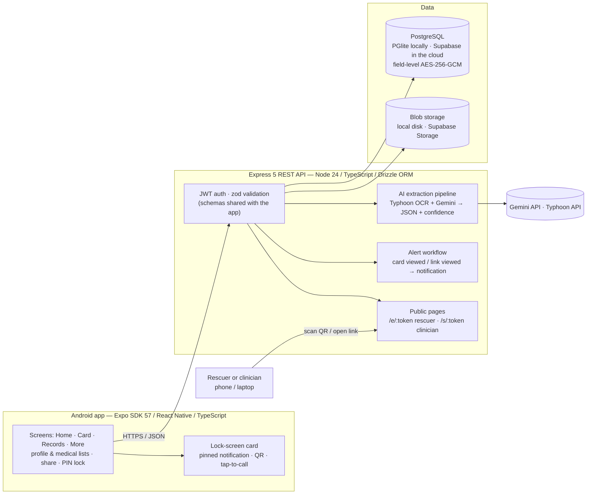

<p align="center"></p>

# MediFirstCard

[](../../actions) [](../../actions)

> **Educational prototype (course 040333215 Smart Technology 2026).** Not a medical device. It does not diagnose, treat, cure, or prevent any condition. Emergency information is self-reported and unverified.

An Android emergency health ID card and medical-records archive: a user-chosen emergency card pinned to the lock screen, tap-to-call emergency contacts and Thai EMS (1669), a PIN-protected archive of scanned medical certificates with AI extraction and human review, and QR/link sharing for rescuers and clinicians.

> ภาษาไทย: แอปบัตรฉุกเฉินและคลังเอกสารทางการแพทย์บนแอนดรอยด์ แสดงข้อมูลฉุกเฉินบนหน้าจอล็อก โทรหาผู้ติดต่อฉุกเฉินและ 1669 ได้ทันที เก็บเอกสารหลังรหัส PIN พร้อมดึงข้อมูลด้วย AI และแชร์ผ่าน QR/ลิงก์ ต้นแบบเพื่อการศึกษาเท่านั้น

## Group members and their roles

| Member | Role | Owns |
|---|---|---|
| ปิยนุช นุ่มน้อย | Project Manager / System Analyst | Test plan, worklog, handout, README sections, seed/demo data, weekly test runs on the phone, cloud accounts, demo logistics |
| เหม่หลิ๋ง ตัน | UX/UI Designer & Medical Consultant | Wireframes, design tokens and theme, Thai/English strings, assets, login/register/consent screens, synthetic sample documents, screenshots, videos |
| ณัฐพัชร์ ทัศนะเมธี | Lead / main programmer | Architecture and the rest of the code: `apps/api`, `apps/mobile`, `packages/shared`, native config, CI, releases; reviews every change |

Details and GitHub handles in [CONTRIBUTORS.md](CONTRIBUTORS.md). Implementation is AI-assisted (Claude) and disclosed there; every change is directed, reviewed and committed by the member who owns the files.

## Problem and motivation
In an emergency the first responders cannot see blood type, allergies, chronic conditions or an emergency contact because the phone is locked; medical certificates are scattered on paper and lost when changing hospitals. MediFirstCard keeps a patient-held, encrypted copy and shows a chosen subset on the lock screen, with one-tap calling to the people who matter.

## Main features
Everything below runs today on a real Android phone. Verified 2026-09-04 both against the laptop API (embedded database, mock extractor) and against the full cloud stack: Supabase PostgreSQL + Storage, Google Gemini 3.5 Flash-Lite with SCB 10X Typhoon OCR (screenshots below).

- **Emergency card** — name, blood group (Rh-negative flagged), allergies in red, conditions, medications and emergency contacts, in "first 60 seconds" order. **Call 1669** button and a **Call** button on every contact (opens the dialer with the number).
- **Lock-screen card** — the same card pinned as a permanent notification on a public-visibility channel, readable without unlocking, with a **Call 1669** action. It is re-posted the moment it is swiped away and again after a reboot or app update (a small native Android module, `apps/mobile/modules/lock-card`), and refreshed whenever the profile changes. The user chooses which fields are exposed and is warned about exposure.
- **Emergency profile** — identity, date of birth (system date picker), sex, blood group, medical flags (blood thinners, insulin, pacemaker, dialysis, pregnancy), insurance scheme, notes; separate editors for **allergies, conditions, medications and emergency contacts** (Thai phone validation, informed-consent flag, call priority). A stale "no known drug allergies" flag is cleared by the server as soon as an allergy is listed, so the card can never hide a real allergy.
- **Rescuer surfaces** — QR code and public link (`/e/:token`) rendered as a dependency-free HTML page with tap-to-call, plus an in-app "preview as rescuer".
- **Document archive** — scan from camera or gallery → resize/JPEG → SHA-256 dedupe → upload → AI extraction → **red-field review** (every extracted field editable with a confidence chip; low-confidence fields highlighted) → record with kind, facility, doctor, licence, issue date and auto-computed validity; detail view with the original image; delete.
- **Share with a clinician** — temporary links (1 h / 24 h / 3 days) over selected documents, optional 4-digit passcode (5 failures revoke the link), view counts, revoke, access log; the public clinician page (`/s/:token`).
- **Alerts** — in-app notifications when the card or a shared link is viewed (or a link is revoked), plus an e-mail to the owner's account address when a Resend key is configured (never blocks the rescuer page).
- **Privacy** — PDPA consent screen stating the purposes and naming the AI providers; withdraw consent (revokes all links); delete account (hard delete + storage cleanup + tombstone).
- **Security** — JWT access/refresh with rotation and reuse detection (single-flight refresh on the client), AES-256-GCM encryption of every health-content column, optional app PIN with fingerprint/face unlock, route guard.
- **Bilingual UI** — Thai and English, switchable in More; Buddhist-era dates in Thai.

## Advanced features (rubric: ≥5 from ≥3 categories, ≥2 genuine integrations)

| # | Feature | Category | Genuine integration | Code |
|---|---|---|---|---|
| A1 | Express 5 REST API with JWT auth, rotation + reuse detection (36 routes) | 2 API / Backend | Yes | `apps/api` |
| A2 | PostgreSQL (PGlite locally / node-postgres on Render), structured schema with timestamps, field-level AES-256-GCM, SHA-256 duplicate detection, blob storage adapter | 1 Data & Storage | Yes | `apps/api/src/db`, `crypto`, `storage` |
| A3 | AI document extraction: Typhoon OCR → Gemini structured JSON with per-field confidence and evidence, human-in-the-loop red-field review; deterministic mock as the offline fallback (verified live on a phone: every field of the synthetic certificate read correctly) | 4 AI / ML | Yes | `apps/api/src/modules/extract`, `apps/mobile/src/components/RecordReviewForm.tsx` |
| A4 | Card-viewed / share-viewed / link-revoked alert workflow: in-app notification for the owner plus a bilingual e-mail to the owner's account address through Resend | 2 Automation | Yes | `apps/api/src/modules/alerts` |
| A5 | PDPA consent, lock-screen exposure warning, role-based views (owner / rescuer / clinician), status colours, elderly-friendly type | 5 Medical UI/UX | — | `apps/mobile` |
| A6 | Permanent lock-screen notification (native module, re-posted on swipe/reboot), dialer intent (tap-to-call, 1669), camera/photo picker, system date picker, PIN + biometrics | 3 Device / Sensors | — | `apps/mobile/modules/lock-card`, `apps/mobile/src/lib/notifications.ts`, `phone.ts`, `pin.ts` |

## System architecture diagram



Request flow for one scanned certificate: photo → resized to 1600 px JPEG on the phone → SHA-256 (duplicates rejected with 409) → `POST /records` → `PUT /records/:id/blob` → `POST /records/:id/confirm` → `POST /records/:id/extract` → JSON with a confidence and evidence snippet per field → user edits red fields → `PUT /records/:id` stores encrypted columns.

## Project structure

```
apps/
  api/        Express 5 API: src/auth, src/modules/{profile,records,extract,share,alerts,notifications,consent,public,health},
              src/db (Drizzle schema + migrations), src/crypto, src/storage, test/ (vitest on in-memory PGlite)
  mobile/     Expo app: src/app (Expo Router screens), src/components, src/lib (api, notifications, phone, pin, format),
              src/store (session), src/theme (tokens, Paper themes)
packages/
  shared/     Contract used by both apps: zod schemas, buildCardPayload(), Buddhist-era dates, TH/EN strings
docs/         handout, demo runbook, Render deploy guide, screenshots, synthetic sample documents
.github/      CI: api-ci (shared + API tests), mobile-ci (strict typecheck)
```

## Installation steps
Prerequisites: Node 24 (`.nvmrc`), JDK 17 or 21, Android Studio with SDK Platform 36, `ANDROID_HOME` set. Windows first; macOS/Linux equivalents in each step.

```bash
git clone https://github.com/enchantedglycerin/MediFirstCard C:/mfc && cd C:/mfc   # short path avoids the Windows 260-char build failure
npm install
cp apps/api/.env.example apps/api/.env   # set FIELD_ENC_KEY and JWT_SECRET (instructions in the file)
```

## Install the app on a phone (no build tools needed)
Download the signed APK from the latest [GitHub release](https://github.com/enchantedglycerin/MediFirstCard/releases) and install it (`adb install -r MediFirstCard-v1.0.11.apk`, or open the file on the phone and allow the install). Then open **More → Developer → Server URL** and enter the address of the API (the laptop's Wi-Fi IPv4 for a classroom demo, e.g. `http://192.168.1.20:3000`, or the Render URL once deployed).

Release builds are signed with the team's own keystore (certificate `CN=MediFirstCard, OU=Course 040333215`, SHA-256 `07:41:48:86:B0:D6:CE:50:F7:79:51:D6:4B:C4:93:DF:1D:53:BD:A4:9E:D8:E9:50:F9:35:21:93:FF:22:2C:9D`). The keystore and its passwords live in `apps/mobile/credentials/` on the lead developer's machine and are **never committed**; the Expo config plugin `apps/mobile/plugins/withReleaseSigning.js` wires them into Gradle at prebuild and falls back to debug signing when the folder is absent (CI, other machines). Verify a downloaded APK with `apksigner verify --print-certs`.

## How to run the app
**No cloud accounts, no Docker (dev / grader):** the API uses PGlite (embedded Postgres) when `DATABASE_URL` is unset, local-disk storage and the mock extractor.

```bash
npm run api:dev                          # Express on :3000; PGlite auto-migrates to apps/api/.data/pg
cd apps/mobile && npx expo run:android   # ALWAYS from apps/mobile (running it at the repo root corrupts the root package.json); builds + installs the debug app
```
The debug app loads JavaScript from Metro. If it stays on the splash screen, Metro is not reachable: run `npx expo start` in `apps/mobile` from a normal terminal (not a CI shell) and, for a USB phone, `adb reverse tcp:8081 tcp:8081 && adb reverse tcp:8082 tcp:8081 && adb reverse tcp:3000 tcp:3000`. Set the API address under **More → Developer → Server URL** if the phone cannot use `localhost`.

**Cloud (Supabase + Gemini/Typhoon + Render):** fill Part B of `apps/api/.env` (Supabase database URL, service-role key, Gemini and Typhoon keys), then deploy the API with the Render Blueprint in `render.yaml` — step-by-step in [docs/deploy-render.md](docs/deploy-render.md). Release builds default to `https://medifirstcard-api.onrender.com`; any other server can be set under More → Developer → Server URL. Optional: `docker compose up -d db` for a local real Postgres.

Verify the backend (no Docker, no accounts needed):
```bash
npm run shared:test      # 13 tests (card builder incl. tap-to-call phone, dates, validation)
npm run api:test         # 63 tests (auth, profile, card, records, extraction, Gemini/Typhoon/Supabase adapters offline, public pages incl. tel: links, share, consent)
npm run mobile:typecheck # strict TypeScript over the whole app
```

## API / database / AI / sensor configuration
Hosting: the API runs on Render's free tier and is kept awake by two 10-minute pings (a GitHub Actions cron and a `pg_cron` job inside Supabase), so demo requests are not hit by the 30–60 s cold start.

Env reference: [apps/api/.env.example](apps/api/.env.example). Extraction providers: `EXTRACT_PROVIDER=gemini|mock` — `gemini` is live once `GEMINI_API_KEY` is set (Google AI Studio; `GEMINI_MODEL` defaults to `gemini-2.5-flash-lite`). With no key, or if Gemini fails after retries, the API serves the mock extraction labelled `source: "mock"` with a warning code, so the demo never breaks. `OCR_PROVIDER=typhoon|none` optionally adds a Typhoon OCR pass first (`TYPHOON_API_KEY` from playground.opentyphoon.ai) whose Markdown is given to Gemini as extra context; if OCR fails the extraction continues from the image alone (`ocr_unavailable`). Both free tiers may use inputs to improve their models, so only synthetic documents go through them. Storage: `STORAGE_PROVIDER=local|supabase` — `supabase` uses Supabase Storage over REST and needs `SUPABASE_URL`, `SUPABASE_SERVICE_ROLE_KEY` and a private `SUPABASE_BUCKET`. Database: `DATABASE_URL` unset → PGlite on disk. **Device / sensors:** camera and photo picker (document capture), dialer intent (tap-to-call), notification channel with lock-screen visibility, fingerprint/face via `expo-local-authentication`; no IoT sensor. **What is encrypted:** every health-content text column (names, allergy substances/reactions, conditions, medications, contact names and phones, record titles/facility/doctor/licence, notes); enums, dates, blood group and IDs stay plain for filtering.

## Data management, state and error handling
- **Structured schema with timestamps and metadata** — every table has `created_at`/`updated_at`; records carry kind, status (`pending → uploaded → extracted → reviewed`), MIME, size, SHA-256 and validity; share links keep expiry, view count, revocation and an access log.
- **Validation in one place** — zod schemas in `packages/shared` are used by the API (request bodies) and the app (forms): Thai phone `0XXXXXXXXX`, Thai national ID checksum, ISO dates, enums, size limits; duplicate documents are rejected by hash.
- **App state** — TanStack Query caches server data and invalidates after every mutation; a zustand store holds the session (tokens in SecureStore); the PIN never leaves the device (salted, iterated SHA-256).
- **History** — records list with dates and status, notification feed, per-link access log, consent versions.
- **Testing** — 13 shared unit tests and 70 API tests (integration on an in-memory PGlite database, plus the Gemini/Typhoon/Supabase/Resend adapters against a fake `fetch`) run in CI; the app is typechecked in strict mode in CI; every flow was exercised on two physical phones.
- **Error handling** — the API returns coded JSON errors (`DUPLICATE_RECORD`, `NO_PROFILE`, `UNAUTHENTICATED`, …) through one error middleware; the app maps them to Thai/English messages, retries expired tokens once with a single-flight refresh, and shows "cannot reach the server" instead of crashing when the API is down.

## Screenshots
Taken on a Samsung phone (Android 13) and a Redmi (Android 14). All are in [docs/screenshots/](docs/screenshots/).

| Live Gemini + Typhoon review (cloud) | Record detail, image from Supabase Storage | The card on a real lock screen (Redmi, Android 14) | Dashboard with completeness |
|---|---|---|---|
|  |  |  |  |

| Emergency card (Call 1669, contact Call) | Tap-to-call opens the dialer | Clinician share link | PIN lock on launch |
|---|---|---|---|
|  |  |  |  |

| PDPA consent | Emergency contacts | Card in Thai | Alerts and language |
|---|---|---|---|
|  |  |  |  |

| "None known" chosen<br>on the Allergies page | Date of birth picked,<br>never typed | Lock-screen card settings | Records list |
|---|---|---|---|
|  |  |  |  |

## Demo video links
- App introduction video (≤ 3 min): _to be added before 7 Oct 2026_
- Live demo recording: _to be added after the demo on 7 Oct 2026_

## Limitations
Lock-screen card is a permanent notification; how much of it shows on the lock screen depends on the phone's notification privacy setting, and Android 14+ lets the user swipe it away while unlocked (it comes straight back). The Android 16 lock-screen widget hub is not targeted. iOS designed but not built. AI is assistive; the shipped provider is a deterministic mock until Gemini/Typhoon keys are added, and Thai handwriting is unverified; document images would go to Google Gemini and SCB 10X Typhoon (free tiers that may use inputs), so the demo uses synthetic documents only. Alert e-mail needs a Resend key; on Resend's free tier without a verified domain it can only reach the account owner's own address (`ALERT_EMAIL_TO`), so per-user delivery needs a domain. Single server encryption key; PIN lock-out signs the user out after 5 failures; not PDPA-audited; no guardian consent for minors; not connected to Mor Prom / Health Link; no offline cache; free-tier server sleeps. Cloud deployment (Supabase + Render) is scripted but not yet provisioned.

> ภาษาไทย:
การแจ้งเตือนบนหน้าจอล็อก: การ์ดบนหน้าจอล็อกเป็นการแจ้งเตือนแบบถาวร โดยปริมาณข้อมูลที่จะแสดงบนหน้าจอล็อกขึ้นอยู่กับการตั้งค่าความเป็นส่วนตัวของการแจ้งเตือนในโทรศัพท์ และใน Android 14 ขึ้นไป ผู้ใช้สามารถปัดการแจ้งเตือนออกได้ขณะที่โทรศัพท์ปลดล็อกอยู่ แต่การแจ้งเตือนจะกลับมาแสดงอีกครั้งทันที
ระบบ Lock-screen widget hub ของ Android 16 ยังไม่ได้ถูกนำมาใช้
iOS: มีการออกแบบสำหรับ iOS ไว้แล้ว แต่ยังไม่ได้พัฒนาหรือสร้างขึ้นจริง
AI: AI ถูกใช้เป็นตัวช่วยในการทำงาน โดยเวอร์ชันที่นำมาใช้งานในปัจจุบันเป็นเพียง ระบบจำลอง (mock) ที่ให้ผลลัพธ์แบบกำหนดแน่นอน (deterministic) จนกว่าจะมีการเพิ่ม API Key ของ Gemini/Typhoon
ความสามารถในการอ่าน ลายมือภาษาไทย ยังไม่ได้รับการตรวจสอบยืนยัน
ข้อมูลรูปภาพของเอกสาร: หากใช้เอกสารจริง รูปภาพของเอกสารจะถูกส่งไปยัง Google Gemini และ SCB 10X Typhoon ซึ่งเป็นบริการที่มี Free Tier และอาจมีการนำข้อมูลที่ส่งเข้าไปใช้ตามเงื่อนไขของบริการ ดังนั้น ในการสาธิตระบบจึงใช้ เอกสารจำลอง (synthetic documents) เท่านั้น
การแจ้งเตือนทางอีเมล: ต้องใช้ Resend API Key และหากใช้ Resend Free Tier โดยยังไม่มี Domain ที่ผ่านการยืนยัน ระบบจะส่งอีเมลไปยังอีเมลของเจ้าของบัญชีเอง (ALERT_EMAIL_TO) เท่านั้น หากต้องการให้สามารถส่งแจ้งเตือนไปยังผู้ใช้แต่ละคนได้ จำเป็นต้องมี Domain ที่ผ่านการยืนยัน
การเข้ารหัสข้อมูล: ระบบใช้ Encryption Key เพียงหนึ่งชุดสำหรับทั้งเซิร์ฟเวอร์
การล็อกบัญชีด้วย PIN: หากกรอก PIN ผิด 5 ครั้ง ระบบจะทำการ ออกจากระบบ (Sign out) ของผู้ใช้
PDPA: ระบบยังไม่ได้ผ่านการตรวจสอบหรือรับรองด้าน PDPA อย่างเป็นทางการ
ผู้ใช้อายุต่ำกว่า 18 ปี: ระบบยังไม่มีขั้นตอนสำหรับการขอ ความยินยอมจากผู้ปกครอง
การเชื่อมต่อระบบสุขภาพ: ระบบยังไม่ได้เชื่อมต่อกับ Mor Prom (หมอพร้อม) หรือ Health Link
การใช้งานแบบออฟไลน์: ระบบยังไม่มีการเก็บข้อมูลแบบ Offline Cache ดังนั้นจึงไม่สามารถใช้งานฟังก์ชันดังกล่าวได้เมื่อไม่มีอินเทอร์เน็ต
Free Tier Server: เซิร์ฟเวอร์ที่ใช้ Free Tier อาจเข้าสู่สถานะ หยุดทำงานชั่วคราว (sleep) เมื่อไม่มีการใช้งาน ทำให้การตอบสนองครั้งแรกหลังจากไม่มีการใช้งานอาจล่าช้า
การ Deploy ขึ้น Cloud: ขั้นตอนการ Deploy ระบบขึ้น Cloud ด้วย Supabase + Render มีการเขียน Script เตรียมไว้แล้ว แต่ ยังไม่ได้ดำเนินการสร้างและตั้งค่าระบบจริง (provisioning)


## Future development directions
Verifying the Gemini + Typhoon extraction and Supabase Storage adapters against the real free tiers (wired and tested offline; no keys provisioned yet), Render deploy, iOS WidgetKit, edge-detecting scanner, vaccination module, offline cache, push notifications, FHIR export to hospitals, NFC card.

> ภาษาไทย:
ตรวจสอบการทำงานของ Gemini + Typhoon และ Supabase Storage กับ Free Tier จริง (โดยขณะนี้ระบบเชื่อมต่อและทดสอบในโหมด Offline แล้ว แต่ยังไม่ได้ใส่ API Key จริง)
Deploy ระบบด้วย Render เพื่อให้ระบบสามารถทำงานบน Cloud ได้จริง
พัฒนา iOS WidgetKit เพื่อรองรับ Widget บนหน้าจอของอุปกรณ์ iOS
พัฒนาเครื่องสแกนที่สามารถตรวจจับขอบเอกสาร (Edge Detection) เพื่อช่วยให้การถ่ายหรือสแกนเอกสารมีความแม่นยำมากขึ้น
เพิ่มโมดูลวัคซีน (Vaccination Module) สำหรับจัดเก็บและจัดการข้อมูลเกี่ยวกับการฉีดวัคซีน
เพิ่มระบบ Offline Cache เพื่อให้สามารถเข้าถึงข้อมูลบางส่วนได้แม้ไม่มีอินเทอร์เน็ต
เพิ่ม Push Notifications เพื่อส่งการแจ้งเตือนให้ผู้ใช้แบบเรียลไทม์
เพิ่มการส่งออกข้อมูลในรูปแบบ FHIR (FHIR Export) เพื่อให้สามารถนำข้อมูลไปแลกเปลี่ยนหรือเชื่อมต่อกับระบบสารสนเทศของโรงพยาบาลได้
รองรับ NFC Card เพื่อใช้ NFC ในการระบุตัวตนหรือเข้าถึงข้อมูลที่เกี่ยวข้องกับผู้ใช้ได้สะดวกขึ้น


## A statement on responsible use
MediFirstCard is a student educational prototype, not a medical device, and must not be used for diagnosis or treatment. Health data is sensitive personal data under the Thai PDPA: the app asks for explicit consent, states the purposes, names the AI providers, and lets the user withdraw consent and delete all data. Anything shown on the lock screen is readable by anyone holding the phone, so the user chooses each field and is warned before enabling it. Medical staff must confirm blood group, allergies and medications by standard procedures.
